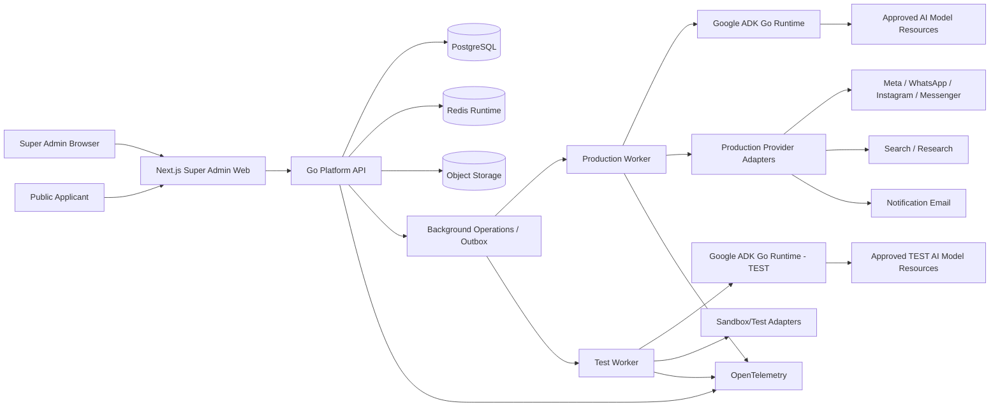

# AI Sales Agent — Technical Architecture & Security Baseline

| Field | Value |
|---|---|
| Document | AI Sales Agent — Technical Architecture & Security Baseline |
| Version | 1.0 |
| Date | 2026-08-18 |
| Session | Sales Agent MVP Base |
| Status | Implementation reference baseline; future architecture changes require ADR/change control |
| Backend baseline | Go |
| Agent runtime | Google ADK for Go v2 |
| Initial implementation scope | Super Admin CP + internal platform/backend + Agent testing foundation |
| Runtime dependency amendment | ADR-0002 — Required Redis Runtime (2026-08-19) |

---

## 1. Purpose

This document defines the technical architecture, security architecture, runtime boundaries, data foundations, API rules, Agent runtime rules, provider-adapter model, TEST/PRODUCTION isolation, observability, testing standards, repository structure, deployment assumptions, and vibe-coding delivery rules for the AI Sales Agent MVP.

It is intended to be the technical reference used during environment preparation and milestone-by-milestone implementation.

This document does **not** change approved product behavior. Product behavior continues to be governed by the approved project source-of-truth documents. Where an older BRD/PRD body contains concepts superseded by the approved Super Admin amendment/Decision Register, the superseding approved decision controls.

### 1.1 Source-of-truth hierarchy

For implementation, use this precedence:

1. Approved Super Admin Decision Register.
2. Approved Super Admin CP MVP Specification and approved amendments.
3. Approved Master PRD / Blueprint.
4. Approved BRD.
5. Approved Stage 1 Lock Report.
6. Approved technical ADRs and this architecture baseline.
7. Code and migrations only when consistent with the above.

Code never becomes the requirement merely because it was implemented.

### 1.2 Known product items not invented by this architecture

This architecture deliberately does not invent unresolved business behavior for:

- final Campaign lifecycle D-274 until explicitly confirmed;
- detailed customer-facing file/document replacement/deletion lifecycle;
- final provider-policy and legal/privacy rules;
- full Arabic/RTL product scope;
- post-MVP features explicitly deferred by the product baseline.

Security foundations for those areas may be built, but unresolved product behavior must remain configurable/blocked rather than guessed.

---

## 2. Architectural Principles

The following principles are mandatory.

### ARCH-PR-001 — Modular monolith first

The MVP is a **modular monolith** with explicit domain boundaries. It is not a distributed microservice architecture.

Separate deployable processes may exist for the API and workers, but they share the same domain/application packages and one source of business rules.

### ARCH-PR-002 — Application services are authoritative

The deterministic application owns:

- authentication;
- authorization;
- tenant and Project scope;
- lifecycle transitions;
- limits and entitlements;
- idempotency;
- concurrency control;
- audit;
- suppression and protected state;
- provider side-effect authorization;
- secret access;
- business persistence.

No LLM prompt, Agent output, frontend control, or ADK session may override these rules.

### ARCH-PR-003 — AI is untrusted

Every Agent and model response is treated as untrusted input until schema validation and deterministic business validation succeed.

Agents may reason, recommend, classify, draft, summarize, and request allowed tools. Agents do not become a security principal with unrestricted authority.

### ARCH-PR-004 — Deny by default

For authorization, Agent tools, Agent-to-Agent calls, provider access, secret resolution, network destinations, and production side effects, absence of an explicit grant means deny.

### ARCH-PR-005 — Server-side security only

UI hiding is never authorization. Every protected action is independently enforced by the backend.

### ARCH-PR-006 — Explicit scope everywhere

Every tenant-owned resource, query, job, Agent context, object, file, provider event, and log reference carries authoritative scope information.

### ARCH-PR-007 — TEST fails closed

A TEST execution may never fall back to a production side-effect adapter, credential, customer database mutation, campaign publication, or outbound customer message.

If a sandbox implementation is unavailable, the test fails.

### ARCH-PR-008 — External side effects are controlled operations

No provider side effect is performed directly from a controller, prompt, or Agent. It passes through an application operation with authorization, validation, idempotency/reconciliation rules, audit/operational logging, and environment checks.

### ARCH-PR-009 — Immutable history where history matters

Package snapshots, production Agent Versions, Agent Runs, pricing basis, Audit Events, and other approved historical objects are not silently rewritten.

### ARCH-PR-010 — Simple infrastructure until justified

Use PostgreSQL as the primary durable coordination and business datastore. Do not introduce Kafka, Kubernetes, service mesh, or large workflow infrastructure during MVP unless a demonstrated requirement cannot be met safely without it.

Redis is a required, non-authoritative application-runtime dependency. It may support only explicitly designed ephemeral concerns; it does not replace PostgreSQL-backed durable state or operations.

---

## 3. Approved Implementation Scope

The first implementation phase contains:

- Super Admin frontend;
- Super Admin backend/domain services;
- Super Admin email/password/OTP authentication;
- public Organization applications needed by the Super Admin flow;
- Organization lifecycle and account management;
- Packages and Package Versions;
- Strategy Credits, Project Limits, Lead Limits, numeric Organization overrides;
- AI usage and cost attribution;
- Organization integrations;
- Core Platform Integrations;
- AI provider/model/credential resource registry;
- fixed AI Agent Registry;
- Agent Versions and configuration;
- simple Agent Test harness;
- Customer Simulator and Evaluator;
- System Health and operational issues;
- background operations/jobs;
- Logs;
- Agent Runs;
- Platform Audit;
- internal entities/services required to support those functions.

The full company-facing UI is not built in this phase.

---

## 4. System Context



### 4.1 Trust boundaries

The primary trust boundaries are:

1. Browser → API.
2. Public applicant → public endpoints.
3. Super Admin session → protected Control Plane APIs.
4. API/Application → PostgreSQL and Redis runtime infrastructure.
5. Application → Agent runtime.
6. Agent runtime → governed tools.
7. Application → provider adapters.
8. Provider webhooks → inbound integration endpoints.
9. Production execution → TEST execution.
10. Secret store → authorized adapter only.

Each boundary must have explicit authentication/authorization/input validation and observability appropriate to the boundary.

---

## 5. Technology Baseline

### 5.1 Backend

- **Language:** Go.
- **Baseline Go release:** Go 1.26.6 at architecture date; patch level must remain on a supported security-fixed release.
- **HTTP:** Go `net/http` with a lightweight router if needed; avoid a framework that hides authorization/HTTP semantics.
- **Agent framework:** Google ADK Go v2; baseline v2.2.0 at architecture date.
- **Database driver:** pgx v5.
- **SQL generation:** sqlc.
- **Migrations:** Goose v3 using primarily explicit SQL migrations.
- **Observability:** OpenTelemetry.
- **Testing:** standard `go test`, table-driven tests, fuzzing where valuable, integration tests, Testcontainers where appropriate.

### 5.2 Frontend

- Next.js 16 stable release line, exact patch pinned during environment preparation after security review.
- React.
- TypeScript strict mode.
- pnpm with committed lockfile.
- Accessible component primitives; do not bind core business behavior to a UI library.
- TanStack Query where useful for server-state synchronization.
- React Hook Form plus schema validation for complex forms.
- Playwright for browser/end-to-end tests.

### 5.3 Database

- PostgreSQL, supported stable major chosen during environment preparation.
- PostgreSQL is the authoritative source of durable business and security state.
- UUID/opaque identifiers for externally visible records; identifiers are not authorization.
- JSONB only for genuinely flexible/versioned payloads, not as a substitute for core relational entities.

### 5.4 Supporting infrastructure

- S3-compatible object-storage abstraction.
- MinIO locally if object-storage behavior is needed before a cloud provider is chosen.
- Mailpit locally for notification/OTP email capture.
- Redis is required for MVP application runtime and API readiness.
- Redis is limited to short-lived, reconstructible concerns such as rate limiting, coordination, justified caching, and other explicitly designed ephemeral functions.
- Redis must never be the authoritative or sole store for Organizations, Packages, Agents, Audit, authentication identities, or any other durable business record.

### 5.5 Dependency pinning

All dependencies are version pinned through Go modules and frontend lockfiles. CI must fail for known reachable Go vulnerabilities via `govulncheck` or equivalent approved checks.

---

## 6. Runtime Topology

Initial runtime processes:

```text
admin-web            Next.js Super Admin/public web
platform-api         Go HTTP API
prod-worker          Go production background/Agent/provider worker
test-worker          Go TEST-only Agent worker
scheduler            Go scheduled-operation process or worker scheduling loop
```

All Go processes import the same domain/application modules. No duplicate business-rule implementation is allowed in workers.

### 6.1 Why API and workers are separate processes

This allows:

- independent scaling;
- clean timeout boundaries;
- production vs TEST credentials;
- side-effect isolation;
- cancellation/retry control;
- safer long-running Agent/provider operations.

They are not separate microservices with separate business ownership.

---

## 7. Repository Structure

```text
sales-agent/
├── apps/
│   └── admin-web/
│       ├── src/
│       ├── tests/
│       ├── package.json
│       └── pnpm-lock.yaml
│
├── backend/
│   ├── cmd/
│   │   ├── api/
│   │   ├── worker/
│   │   ├── test-worker/
│   │   ├── scheduler/
│   │   └── platform-admin/
│   │
│   ├── internal/
│   │   ├── platform/
│   │   │   ├── auth/
│   │   │   ├── applications/
│   │   │   ├── organizations/
│   │   │   ├── packages/
│   │   │   ├── integrations/
│   │   │   ├── aiusage/
│   │   │   ├── agents/
│   │   │   ├── agenttesting/
│   │   │   ├── operations/
│   │   │   ├── health/
│   │   │   ├── logs/
│   │   │   └── audit/
│   │   │
│   │   ├── agentruntime/
│   │   ├── providers/
│   │   ├── storage/
│   │   ├── persistence/
│   │   ├── security/
│   │   └── shared/
│   │
│   ├── db/
│   │   ├── migrations/
│   │   ├── queries/
│   │   └── sqlc.yaml
│   ├── go.mod
│   └── go.sum
│
├── contracts/
│   └── openapi/
│
├── docs/
│   ├── source-of-truth/
│   ├── architecture/
│   ├── adr/
│   ├── api/
│   ├── security/
│   └── testing/
│
├── infra/
│   ├── local/
│   └── containers/
│
├── scripts/
│   └── dev/
│
├── .env.example
├── compose.yaml
├── Makefile
└── README.md
```

### 7.1 Module rule

A domain module owns its domain behavior and persistence interface. Cross-module writes occur through application services, not by importing another module's database queries directly.

---

## 8. Domain/Application Layering

Within each domain module, use a lightweight form of hexagonal architecture:

```text
HTTP handler / job / tool adapter
            ↓
Application service / use case
            ↓
Domain policy / state transition
            ↓
Ports (repository/provider/audit/etc.)
            ↓
Infrastructure adapters
```

### 8.1 Handlers

Handlers are responsible for:

- parsing transport input;
- authentication context;
- request validation;
- invoking one application use case;
- mapping application errors to API errors.

Handlers do not contain protected business rules.

### 8.2 Application services

Application services are responsible for:

- authorization;
- transaction scope;
- idempotency;
- business sequence;
- domain validation;
- audit creation;
- operation/outbox creation;
- concurrency decisions.

### 8.3 Domain policies

Domain code owns deterministic state transitions and invariants.

### 8.4 Infrastructure

Infrastructure owns:

- PostgreSQL implementation;
- Redis runtime adapter;
- object storage;
- email delivery;
- provider HTTP clients;
- ADK runtime bridge;
- secret resolution;
- telemetry exporters.

---

## 9. Core Domain Modules

### 9.1 Authentication

Entities:

- `SuperAdminAccount`
- `AuthenticationChallenge`
- `SuperAdminSession`
- `RecoveryEvent`

### 9.2 Applications

- `RegistrationApplication`
- application review state/history
- duplicate-identity checks

### 9.3 Organizations

- `Organization`
- `User`
- `Membership`
- owner invitation/account linkage
- Organization lifecycle

Approved Organization lifecycle is exactly:

```text
INACTIVE -> ACTIVE -> DELETED
INACTIVE -> DELETED
```

No Suspension and no Restore in this MVP.

### 9.4 Packages & Limits

- `Package`
- `PackageVersion`
- `OrganizationPackageSnapshot`
- `OrganizationLimitOverride`
- effective-limit service
- usage projections and impact preview

### 9.5 Integrations

- `PlatformIntegration`
- `OrganizationIntegration`
- `CredentialResourceReference`
- `IntegrationCapability`
- `ConnectionTest`

### 9.6 AI Provider Registry

- `AIProvider`
- `AIModelResource`
- `AICredentialResource`
- `ModelCapability`
- `ModelPricingVersion`

### 9.7 Agent Registry

- `AgentDefinition`
- `AgentVersion`
- `ToolDefinition`
- `AgentToolGrant`
- `AgentInteractionRule`
- `AgentRun`
- `ToolCallRecord`

The Agent Definition registry is fixed to the ten approved Agents.

### 9.8 Agent Testing

- `AgentTestRun`
- `AgentTestInputReference`
- `AgentTestResult`
- `EvaluatorResult`
- TEST chat/session records where needed

### 9.9 AI Usage & Cost

- `AgentRunUsage`
- `AgentRunCost`
- immutable pricing basis/reference
- cost classification including `UNPRICED`

### 9.10 Operations / System Health

- `BackgroundOperation`
- `OperationAttempt`
- `OperationalIssue`
- `ServiceHealth`

### 9.11 Logs

- `OperationalLogEvent`

### 9.12 Audit

- `AuditEvent`

---

## 10. Data Ownership and Multi-Tenant Isolation

### 10.1 Scope categories

Every persisted object must be classified as one of:

- platform-global;
- Organization-private;
- Project-private;
- reusable Business Pool;
- reusable Master Lead Pool;
- sensitive execution content;
- TEST-only.

### 10.2 Mandatory tenant keys

Tenant-owned tables carry `organization_id` directly wherever practical. Project-scoped tables also carry `project_id` and either carry `organization_id` or are joined through a constrained FK path that cannot cross Organizations.

Do not rely on a distant join to infer scope for highly sensitive high-volume objects if explicit scope materially reduces leakage risk.

### 10.3 IDOR/BOLA prevention standard

External record IDs are never trusted as proof of access.

Every endpoint/tool that receives an object ID must validate object-level access before read or mutation.

Secure repository/service patterns prefer scope-aware methods such as:

```text
GetProjectForOrganization(orgID, projectID)
GetProjectLeadForProject(projectID, projectLeadID)
GetOrganizationIntegration(orgID, integrationID)
```

rather than loading an object globally and hoping a caller checks scope later.

For Super Admin, platform-level authorization permits global reads, but sensitive trace reveal and protected actions still require explicit action policies.

### 10.4 Object-property authorization / mass assignment

Incoming request DTOs are allowlists. Do not bind JSON request bodies directly into persistence/domain structs.

Fields such as these must never be mass assignable from an untrusted client:

- Organization status;
- owner authority;
- Package snapshot internal IDs;
- entitlement flags;
- usage counters;
- audit fields;
- Agent Definition hard boundaries;
- Agent Version approval/activation metadata;
- provider credential references not permitted for the operation;
- cost fields;
- environment;
- retry safety classification.

### 10.5 Defense-in-depth RLS

PostgreSQL Row-Level Security may be applied to high-risk future customer-facing tenant tables after the data model is finalized. It is defense in depth, not a replacement for application authorization.

For Super Admin-only tables, least-privilege DB roles and application policies remain primary.

---

## 11. Database Security and Persistence Rules

### 11.1 Separate database roles

Use separate roles for:

- migration/DDL;
- API runtime;
- production worker;
- TEST worker;
- read-only diagnostics if later needed.

Runtime roles do not receive schema-owner privileges.

### 11.2 SQL injection

Use pgx/sqlc parameterized queries only. Dynamic SQL identifiers/order clauses must be selected from allowlisted server-side enums and never concatenated from arbitrary client/model input.

### 11.3 Transactions

Protected multi-record state changes and their Audit Event are committed atomically where possible.

Examples:

- application approval + Organization creation + owner membership + Package snapshot + audit;
- Package change + new snapshot + override clearing + audit;
- Organization logical deletion + external-action prohibition + pending-action obsolescence + audit intent;
- Agent activation + previous Active retirement/state change + audit.

### 11.4 Optimistic concurrency

Mutable administrative resources include a `version` or equivalent concurrency token.

Mutations that depend on a stale resource version return a conflict instead of silently overwriting concurrent changes.

Use atomic SQL conditions for high-risk transitions.

### 11.5 Pessimistic/atomic concurrency where required

Use row locks/atomic updates for operations such as:

- exactly one ACTIVE Agent Version;
- idempotent application approval;
- operation claim;
- Package assignment/change;
- future handover claim;
- cost finalization if concurrent usage records arrive.

### 11.6 Migration policy

- SQL migrations are append-only once merged/released.
- Production migrations are forward migrations; rollback normally deploys a corrective forward migration.
- Destructive schema changes use expand/migrate/contract patterns.
- CI starts from an empty database and applies the full migration chain.
- Seed data required for fixed Agent Definitions is version-controlled and deterministic.
- Business data is not embedded casually in schema migrations.

---

## 12. API Architecture

### 12.1 Style

Versioned REST/JSON API:

```text
/api/v1/auth/*
/api/v1/applications/*
/api/v1/organizations/*
/api/v1/packages/*
/api/v1/integrations/*
/api/v1/ai-providers/*
/api/v1/agents/*
/api/v1/agent-tests/*
/api/v1/agent-runs/*
/api/v1/operations/*
/api/v1/health/*
/api/v1/logs/*
/api/v1/audit/*
```

### 12.2 OpenAPI

The backend owns the API schema. Frontend types/clients should be generated or validated against OpenAPI to reduce drift.

### 12.3 Error envelope

All expected application errors use a stable shape:

```json
{
  "error": {
    "code": "ORGANIZATION_ALREADY_DELETED",
    "message": "The organization is read-only because it has been deleted.",
    "correlation_id": "...",
    "field_errors": []
  }
}
```

Do not return stack traces, SQL text, secret values, provider tokens, internal prompts, or internal topology to clients.

### 12.4 Status semantics

Use HTTP status codes consistently:

- `400` malformed/invalid request;
- `401` unauthenticated;
- `403` authenticated but unauthorized;
- `404` not found or intentionally non-disclosing resource result;
- `409` state/concurrency/idempotency conflict;
- `422` structured semantic validation where appropriate;
- `429` rate limited;
- `503` dependency/readiness unavailable when applicable.

### 12.5 Process health endpoints

- `GET /health/live` reports only whether the API process is alive. It does not query PostgreSQL or Redis.
- `GET /health/ready` uses bounded checks and returns `200 {"status":"ready"}` only when both PostgreSQL and Redis are present and healthy.
- A missing, failed, or timed-out PostgreSQL or Redis dependency returns `503 {"status":"not_ready"}` without exposing raw dependency errors.

Redis failure must never cause:

- fallback to unsafe or permissive state;
- bypass of authentication, authorization, tenant isolation, rate limits, or other security controls;
- loss of authoritative business records;
- a false `READY` or `HEALTHY` signal.

### 12.6 Long-running work

Long Agent/provider operations return an operation resource, not an HTTP request held open indefinitely.

```text
POST -> accepted operation
GET  -> current operation state
SSE  -> optional progress/streaming for user-visible live work
```

SSE is preferred over WebSockets unless true bidirectional streaming is required.

---

## 13. Super Admin Authentication Architecture

Approved flow:

```text
Email
-> Password
-> 6-digit OTP by email
-> OTP verification
-> server-side Super Admin session
```

### 13.1 Password storage

- Argon2id.
- Unique salt per password.
- Parameters meet at least current OWASP minimum guidance and are benchmarked for the deployment environment.
- Passwords are never encrypted for recovery and never logged.
- Password verification is constant-time where applicable through vetted crypto primitives.

### 13.2 Authentication enumeration

Login responses should avoid unnecessary account-existence disclosure. Operational logs may record the internal reason securely.

### 13.3 OTP generation and storage

- Use a cryptographically secure random source.
- Six digits as approved.
- Never persist plaintext OTP.
- Because six-digit OTPs are low-entropy, store an HMAC/hash bound to the challenge using a server-held pepper/secret, not a naked fast hash that becomes trivially brute-forceable after DB compromise.
- Validity: 10 minutes.
- Failed attempts: maximum 5.
- Resend cooldown: 60 seconds.
- Resend atomically invalidates the previous challenge code.
- Successful verification consumes the challenge.

### 13.4 Session token

Use an opaque random session secret of at least 256 bits.

Browser cookie recommendation:

```text
__Host-sa_session
Secure
HttpOnly
SameSite=Strict
Path=/
no Domain attribute
```

Only a cryptographic hash of the session token is stored server-side.

### 13.5 Session expiration

The system must support both idle and absolute expiration. Initial secure defaults are configuration, not product logic. A reasonable starting baseline is a short idle timeout and workday-scale absolute timeout; exact values are locked during environment preparation/security configuration.

### 13.6 Session revocation

Logout revokes the server-side session immediately. Password/security recovery may revoke all sessions.

### 13.7 Session fixation

Never reuse a pre-authentication challenge/token as the authenticated session token. Issue a new independent session secret after successful OTP verification.

### 13.8 Rate limiting

Rate-limit at least:

- password login attempts;
- OTP verification attempts;
- OTP resends;
- recovery operations.

Use layered keys where safe: account/challenge plus IP/network heuristics. Do not make IP the sole identity key.

### 13.9 Emergency recovery

There is no normal UI OTP bypass.

A deployment-level `platform-admin` recovery command is available only to infrastructure-authorized operators with production secret/deployment access. It must:

- require explicit reason;
- use one-time short-lived recovery authorization;
- not reveal the existing password;
- not permanently disable OTP;
- revoke/rotate recovery material after use;
- create an immutable recovery audit/security event.

---

## 14. Browser and Web Security

### 14.1 CSRF

Because authentication uses cookies, mutating requests require CSRF protection.

Use a server-issued CSRF token or equivalent robust pattern plus Origin validation. SameSite is defense in depth and is not the only control.

### 14.2 CORS

- Production CORS allowlist contains only approved frontend origins.
- Never use wildcard origins with credentials.
- Development origins are explicit.

### 14.3 Security headers

Production responses should include an appropriate baseline:

- HSTS;
- `Content-Security-Policy`;
- `frame-ancestors 'none'` or equivalent anti-framing policy;
- `X-Content-Type-Options: nosniff`;
- restrictive `Referrer-Policy`;
- suitable Permissions Policy.

### 14.4 XSS

- React rendering remains escaped by default.
- Avoid arbitrary HTML rendering.
- Any rich text/HTML source is sanitized with an allowlist before rendering.
- Provider/user/Agent content is never treated as trusted HTML.
- Secrets/session identifiers are never stored in `localStorage`.

### 14.5 Content Security Policy

Use CSP to restrict scripts, frames, object embedding, network destinations, and inline script usage as the frontend stabilizes.

---

## 15. Authorization Architecture and IDOR Prevention

### 15.1 Authorization pipeline

Every protected request evaluates applicable controls:

```text
Authenticated session
+ actor type
+ resource scope
+ resource state
+ operation policy
+ tenant/Project ownership where applicable
+ Package/entitlement where applicable
+ integration readiness where applicable
= allow or deny
```

During the Super Admin phase the only internal platform actor is Super Admin. Do not recreate removed Support/Operations/Agent Admin roles.

### 15.2 Authorization is close to the data/use case

Route middleware confirms authentication, but object/action authorization occurs in the application use case before data is returned or mutated.

### 15.3 IDOR test rule

For every endpoint that accepts a record ID, tests must include unauthorized/wrong-scope IDs where meaningful.

For future Organization endpoints, tests must prove Organization A cannot access Organization B by substituting:

- path IDs;
- query IDs;
- JSON IDs;
- nested resource IDs;
- file IDs;
- Agent/Test result IDs;
- provider reference IDs.

### 15.4 Sensitive Agent trace reveal

Sensitive execution content is hidden by default. Reveal requires:

- authenticated Super Admin;
- explicit reveal action;
- a reason if required by the final UX contract;
- server-side policy;
- Audit Event recording the access, without copying the sensitive content into audit.

---

## 16. AI / Agent Security Model

### 16.1 Fundamental rule

The LLM is not a trusted interpreter of platform policy.

Prompt text may describe behavior, but protected rules are implemented outside the prompt.

### 16.2 Direct prompt injection

User-entered instructions may attempt to tell an Agent to:

- ignore system rules;
- reveal hidden prompts or secrets;
- call a forbidden tool;
- access another Organization;
- publish/spend/send;
- change its own permissions;
- return ungrounded facts.

The architecture prevents success by ensuring the model does not possess the underlying authority.

### 16.3 Indirect prompt injection

Assume hostile instructions may exist inside:

- websites;
- search results;
- PDFs/documents;
- product files;
- emails;
- WhatsApp/social messages;
- CRM/lead text;
- tool output;
- metadata.

All such content is **untrusted data**, not higher-priority instructions.

### 16.4 Structured context assembly

Context is assembled server-side by an Agent-specific `ContextAssembler`.

The assembler:

- determines the Organization/Project/Lead scope from authoritative application state;
- chooses only allowed data categories for that Agent Definition;
- labels provenance/source/sensitivity/trust class;
- minimizes irrelevant content;
- never provides raw credentials;
- never lets a prompt arbitrarily widen its scope.

### 16.5 Context scope cannot come from the model

The model may not choose `organization_id`, `project_id`, or equivalent authority boundary for a tool call.

Tool execution receives a server-created `ToolExecutionContext` containing immutable bound scope. If the tool needs a resource ID, it must validate that the resource belongs to that bound scope.

This prevents prompt injection from becoming tool-level IDOR.

### 16.6 Agent output validation

Every meaningful Agent output passes:

1. structured schema validation;
2. required-field/enum/range validation;
3. protected business-rule validation;
4. source/grounding checks where required;
5. side-effect eligibility checks if the output requests an action.

Invalid output is rejected, safely retried within policy, returned as Needs Information/Human Review, or failed. It is not persisted as authoritative state.

### 16.7 Agent outcome standard

Production Agent Runs use:

```text
SUCCESS
RETRYABLE_FAILURE
NEEDS_INFORMATION
NEEDS_HUMAN_REVIEW
BLOCKED
FAILED
```

### 16.8 Prompt secrecy

Do not rely on prompt secrecy as a security control. Hidden prompts may contain behavioral instructions but never secrets, passwords, API tokens, or unique security credentials.

### 16.9 Chain-of-thought

Hidden chain-of-thought is not required, stored, or exposed. Persist structured results, concise rationale/evidence references, tool events, and operational metadata instead.

---

## 17. Agent Tools Security

### 17.1 Tool registry

Tools are system-registered. An Agent Definition contains the maximum permitted tool set. An Agent Version may enable only a subset.

### 17.2 No generic dangerous tools

Do not expose generic tools such as:

```text
RunSQL
ExecuteShell
FetchAnyURL
CallAnyHTTP
ReadAnyFile
SendAnyMessage
UpdateAnyRecord
```

### 17.3 Narrow application tools

Prefer purpose-specific tools such as:

```text
GetApprovedProjectKnowledge
SearchApprovedSources
GetProjectLeadContext
RequestTargetedEnrichment
GetIntegrationReadiness
```

The tool invokes an application service that independently authorizes and validates the call.

### 17.4 Tool argument validation

Tool parameters use explicit schemas with:

- type checks;
- maximum lengths;
- enum allowlists;
- safe numeric ranges;
- scope validation;
- URL/domain validation where applicable.

The LLM cannot pass raw secret references unless the application specifically allows a safe resource identifier.

### 17.5 Tool result minimization

Tools return only information needed for the Agent task. Never return provider access tokens, secret values, unrelated tenant data, or internal database rows wholesale.

### 17.6 Tool-call auditability

Agent Run Detail records tool name, timing, status, sanitized arguments/reference IDs, sanitized result summary/reference, and errors as appropriate.

---

## 18. Agent-to-Agent Security

### 18.1 Fixed interaction graph

Agent-to-Agent interaction is deny-by-default and limited to approved possibilities.

The application, not a free-form coordinator prompt, remains able to enforce the allowed graph.

### 18.2 Structured handoffs

Agent handoffs use structured contracts, not authoritative free-form conversations.

### 18.3 Loop controls

Every multi-Agent workflow defines:

- maximum Agent invocations;
- maximum tool calls where appropriate;
- maximum elapsed time;
- maximum retry count;
- maximum cost/usage budget;
- explicit terminal outcomes.

### 18.4 ADK workflow model

Use ADK Go v2 graph/dynamic workflows where they improve deterministic routing, but do not move deterministic platform rules into ADK merely because ADK can represent them.

Application services stay the source of truth.

---

## 19. Agent Version Runtime Standard

Every production run is pinned at start to:

- Agent Definition;
- exact Agent Version;
- prompt/config snapshot/version;
- provider resource;
- model resource;
- credential resource reference;
- allowed tools;
- allowed interactions;
- relevant runtime limits;
- environment.

In-flight execution does not silently switch when another version becomes Active.

Approved, Active, and Retired Versions are immutable.

Exactly one ACTIVE Version per Agent is enforced atomically.

---

## 20. AI Provider / Model Abstraction

### 20.1 Registry objects

Separate:

```text
AIProvider
AICredentialResource
AIModelResource
ModelPricingVersion
AgentModelBinding
FallbackBinding
```

### 20.2 Model capabilities

Every `AIModelResource` declares capabilities such as:

- TEXT;
- STRUCTURED_OUTPUT;
- TOOL_CALLING;
- STREAMING;
- VISION;
- DOCUMENT_INPUT;
- other future supported capabilities.

An Agent Version can select only a model meeting its required capability set.

### 20.3 ADK bridge

The application resolves a model binding and constructs/uses an ADK-compatible model implementation.

Do not store arbitrary ADK model names as the commercial source of truth.

### 20.4 Provider portability

Gemini may be the first configured provider, but the platform data model and runtime interface must support multiple providers.

Provider parity is not assumed. Capability validation prevents configuring an Agent with a provider/model that cannot support its required behavior.

### 20.5 Fallback

No arbitrary fallback.

An Agent Version/approved configuration may reference an explicit fallback model binding. Before fallback, validate:

- fallback is configured and enabled;
- capability compatibility;
- credential readiness;
- Agent policy allows fallback;
- environment permits it.

Record fallback use in the Agent Run and operational telemetry.

---

## 21. Prompt Injection and Untrusted Content Controls

The platform uses defense in depth; no single prompt instruction is considered sufficient.

### 21.1 Content classification

Every external content item carries metadata such as:

```text
source_type
source_reference
organization_scope
project_scope
trust_class
sensitivity_class
retrieved_at
```

### 21.2 Instruction/data separation

System/developer/platform rules are constructed by the runtime. External content is placed in clearly separated structured context fields and described as data to analyze, not instructions to execute.

### 21.3 Retrieval minimization

Do not inject entire mailboxes, entire websites, all prior Project documents, or unrelated conversations into an Agent prompt.

Retrieve the minimum relevant scope.

### 21.4 Suspicious content behavior

A suspicious phrase in a document is not automatically deleted; it is treated as untrusted. The real defense is that the model lacks authority to expand context, read secrets, or bypass tool/application authorization.

### 21.5 Memory poisoning prevention

Agents may propose memory updates. Application services validate and persist structured memory.

Do not persist raw malicious instructions into high-priority long-term memory.

Reusable Master Lead/Business Pool facts require provenance, scope, confidence/freshness, and reusable/private classification.

### 21.6 Output injection

Agent output is rendered as data. Do not render Agent-provided HTML/JavaScript unsafely or execute code/URLs merely because the Agent returned them.

---

## 22. SSRF and External Fetch Security

Any feature that retrieves URLs discovered from user or Agent input is SSRF-sensitive.

### 22.1 Default

Prefer approved Search/Research provider APIs over arbitrary server-side URL fetching.

### 22.2 If server-side fetching is needed

Implement a controlled fetch service that:

- allows only `http`/`https`;
- rejects file/gopher/ftp and other schemes;
- resolves DNS and blocks loopback, link-local, private, metadata, multicast, and reserved address ranges;
- revalidates redirect targets or disables redirects by default;
- applies DNS rebinding defenses;
- sets strict connect/read/total timeouts;
- caps response bytes;
- restricts content types;
- does not forward internal authentication headers;
- uses an egress/network allowlist where practical;
- logs sanitized destination metadata and correlation IDs.

Agents never receive `FetchAnyURL` access directly.

---

## 23. File and Object Storage Security

The product's detailed file lifecycle remains deferred, but the technical security baseline is mandatory.

### 23.1 Storage

- binaries live in object storage, not PostgreSQL;
- database stores metadata/object reference;
- object keys are generated server-side, not direct user paths;
- TEST and PRODUCTION use separate namespaces/buckets/credentials;
- objects are private by default;
- access uses short-lived signed/application-mediated retrieval.

### 23.2 Upload validation

At minimum:

- size limits;
- filename normalization and generated storage names;
- extension allowlist by feature;
- MIME/content inspection rather than trusting the browser header alone;
- malware scanning/content-disarm pipeline where required before production release;
- archive/decompression limits to prevent zip bombs;
- no execution from upload storage;
- active content cannot be served inline from a trusted application origin without safe disposition/sanitization.

### 23.3 Document prompt injection

Extracted file content is untrusted Agent data and receives the Agent-security controls defined above.

---

## 24. Secret Management

### 24.1 Secret reference pattern

Domain records store secret references, not plaintext secrets.

```text
CredentialResource
    -> secret_ref
    -> metadata/status
```

Only an authorized provider adapter resolves the secret at execution time.

### 24.2 Local

Local developer secrets live outside Git in ignored environment/secret files. `.env.example` contains placeholders only.

### 24.3 Production

Use the cloud platform's managed secret service or equivalent approved vault.

### 24.4 Never redisplay

After entry/replacement, UI shows metadata/status only, not plaintext.

### 24.5 Rotation

Credential replacement creates audit history without preserving plaintext old/new secret values.

### 24.6 Agents

Agents never receive raw provider secrets. Tools and model bridges receive authorized resource references; infrastructure resolves secrets.

---

## 25. Integration and Webhook Security

### 25.1 Outbound adapters

Each external integration has a narrow application port and one or more adapters.

Examples:

```text
AIModelPort
SearchProviderPort
NotificationEmailPort
MetaAdsPort
WhatsAppPort
InstagramPort
MessengerPort
ObjectStoragePort
```

### 25.2 Inbound webhooks

Inbound provider events must:

- use TLS;
- verify provider signature/authentication against the raw request body as required by that provider;
- enforce request size/content-type limits;
- validate timestamp/freshness where supported;
- use provider event/message IDs for deduplication/replay prevention;
- map provider account/resource IDs to Organization/Project from server-side configuration;
- never trust a payload-supplied Organization ID as authorization;
- persist the event/idempotency result before performing downstream actions where required;
- reject invalid signatures without business processing;
- retain safe correlation/provider reference metadata.

### 25.3 Replay protection

Verified does not mean new. Deduplicate provider event IDs and reject/ignore replays safely.

### 25.4 Unsafe provider responses

Provider response data is untrusted. Validate schema/ranges and do not allow unexpected fields to modify internal protected state.

---

## 26. Background Operations and Job Architecture

### 26.1 PostgreSQL durable operations

Initial MVP uses PostgreSQL-backed durable operations instead of introducing a separate queue broker.

Core fields:

```text
id
operation_type
environment
status
resource_scope
idempotency_key
payload_reference
scheduled_at
attempt_count
max_attempts
retry_class
locked_by
locked_at
heartbeat_at
last_error
correlation_id
created_at
updated_at
```

Workers claim jobs atomically, typically using PostgreSQL row locking / `SKIP LOCKED` patterns.

### 26.2 Operation statuses

The exact technical state model may include:

```text
PENDING
RUNNING
SUCCEEDED
FAILED
CANCELLED
OBSOLETE
```

User-facing domain states remain those defined by product specifications.

### 26.3 Retry classes

Every external/background operation declares one of:

- `SAFE_RETRY`: pure/internal or known safe;
- `IDEMPOTENT_EXTERNAL`: provider/idempotency contract guarantees duplicate safety;
- `RECONCILE_BEFORE_RETRY`: side effect may have occurred; query provider state first;
- `NO_AUTO_RETRY`: uncertain or dangerous; requires explicit resolution path.

There is no generic Retry button for uncertain side effects.

### 26.4 Outbox

When a committed business mutation must cause later asynchronous work, write an outbox/operation record in the same transaction as the authoritative state change.

This avoids “DB committed but job lost” gaps.

### 26.5 Cancellation/obsolescence

Workers re-check operation eligibility immediately before external side effects.

For example, before a future customer send, re-check:

- Organization not DELETED;
- Project/action still valid;
- integration still enabled/ready;
- operation not obsolete/cancelled;
- suppression/control rules where applicable;
- environment is PRODUCTION.

---

## 27. Organization Deletion Safety

Logical deletion is a high-risk transaction.

### 27.1 Required ordering

The application transaction must first make new external/commercial operations ineligible, then persist `DELETED` and related cancellation/obsolescence records atomically where possible.

### 27.2 Worker revalidation

Every worker/provider send re-checks Organization eligibility immediately before side effect. A job queued before deletion must not send afterward merely because it was already queued.

### 27.3 Provider-side cleanup

If disabling/cancelling existing external provider state requires follow-up API calls, create explicit shutdown operations after the authoritative internal kill state is committed.

Partial shutdown failures create Operational Issues; they do not reactivate the Organization.

---

## 28. TEST / PRODUCTION Isolation

This is a hard security boundary.

### 28.1 Separate workers

```text
PRODUCTION operation -> prod-worker -> production adapter registry
TEST operation       -> test-worker -> sandbox/test adapter registry
```

### 28.2 Adapter registry separation

The TEST worker process does **not register** live customer side-effect implementations for:

- Meta publish/spend;
- WhatsApp/Instagram/Messenger customer send;
- production customer email;
- production customer state mutation.

A missing sandbox adapter causes `BLOCKED`/test failure, never production fallback.

### 28.3 Credential separation

TEST does not receive production messaging/advertising credentials.

If real AI models are used for Agent logic tests, they use explicitly approved TEST AI credential resources and are still unable to call customer side-effect adapters.

### 28.4 Database isolation

At minimum:

- TEST worker gets a DB role that cannot mutate normal production customer domain tables;
- Agent Test Results may be stored in dedicated test/control tables;
- if Agent logic requires synthetic persistent domain state, use a separate TEST database/schema with separate credentials;
- production data is not copied casually into TEST.

### 28.5 Storage isolation

Separate TEST object namespace/bucket and access credentials.

### 28.6 Network isolation

In production deployment, use egress/network policy where practical so the TEST worker cannot reach live side-effect provider endpoints even if application code is misconfigured.

### 28.7 Environment cannot be model-controlled

`environment` is assigned by the server/job runner. It is never accepted from an Agent output or arbitrary frontend field.

---

## 29. Simple Agent Testing Architecture

The MVP uses the approved simple Agent testing system.

Each test:

- references one Agent Version;
- runs real Agent logic;
- executes in TEST;
- stores inputs, outputs, status, model/provider, duration, AI usage/cost, tool activity, and errors;
- may reference completed upstream Test Results;
- may accept manual uploads where product allows;
- cannot cause production side effects.

Test statuses:

```text
READY
RUNNING
COMPLETED
FAILED
CANCELLED
```

A new Agent Version needs at least one successful test before approval, and a critical Evaluator safety failure blocks activation until changed/retested.

Customer Simulator and Evaluator are implemented as the approved fixed Agents, not as a separate Python evaluation subsystem.

---

## 30. AI Cost Attribution Architecture

Every Agent Run records usage independently from commercial Strategy Credits.

### 30.1 Usage fields

At minimum:

- Organization;
- Project;
- Project Lead where applicable;
- Agent;
- Agent Version;
- provider/model;
- environment;
- input/output/tool/other provider usage as available;
- status;
- timestamps;
- parent/child relationship;
- attempt/retry relationship.

### 30.2 Pricing basis

Cost calculation references an immutable pricing basis/version active for that usage record.

Historical cost is not recalculated when pricing configuration changes.

### 30.3 UNPRICED

If cost cannot be calculated reliably, store `UNPRICED` rather than zero.

### 30.4 Sales AI Cost classifier

The primary Sales AI Cost aggregate is calculated from the approved inclusion rules, not from every Agent Run indiscriminately.

---

## 31. Logging Architecture

### 31.1 Technical logs

Structured JSON technical logs go to stdout/observability pipeline and include safe metadata:

```text
timestamp
level
service
correlation_id
operation_id
environment
resource reference IDs where safe
error code
```

### 31.2 Product Operational Logs

`OperationalLogEvent` is the curated immutable dataset shown in the Super Admin CP.

Levels:

```text
INFO
WARNING
ERROR
```

Production and TEST are explicitly separated; Production is default view.

### 31.3 Logging exclusions

Never log:

- passwords;
- OTPs;
- raw session tokens;
- provider tokens/API secrets;
- secret store values;
- unnecessary full customer prompts/responses;
- hidden chain-of-thought.

### 31.4 Log injection

Normalize structured fields and do not allow user/model text to become unstructured log control content. Escape/encode for display.

---

## 32. Audit Architecture

Audit answers: **what Super Admin changed or authorized**.

### 32.1 Append-only

`AuditEvent` is append-only from application code.

Super Admin UI has no edit/delete endpoint for individual events.

### 32.2 Creation authority

Frontend and Agents never call a generic “create audit event” API.

Trusted application services create audit records as part of the protected operation.

### 32.3 Transactional audit

For synchronous protected mutations, business change and Audit Event commit in the same database transaction whenever possible.

### 32.4 Audit contents

- actor;
- timestamp;
- action;
- resource type/id;
- Organization where applicable;
- meaningful old/new values or references;
- reason when required;
- result;
- correlation ID.

### 32.5 Audit exclusions

Never store passwords, OTPs, raw tokens, secrets, or credential plaintext.

Sensitive trace reveal is audited by reference/event metadata, not by copying the revealed content into Audit.

---

## 33. System Health and Observability

### 33.1 Engineering observability

Use OpenTelemetry for:

- distributed traces across API/worker/Agent/provider operations;
- metrics;
- trace correlation;
- compatible log correlation.

Telemetry backend/vendor remains replaceable.

### 33.2 Product System Health

`ServiceHealth` is application-managed product-operational health for approved components:

- AI Runtime;
- Core Providers;
- Search/Research;
- Meta/platform dependencies;
- Notification Email;
- Background Jobs;
- File Processing if used;
- Agent Operations.

States:

```text
HEALTHY
DEGRADED
DOWN
UNKNOWN
```

### 33.3 Staleness

Every health signal records check/success timestamps. Stale health becomes `UNKNOWN`, not `HEALTHY`.

### 33.4 Operational Issues

`OperationalIssue` states:

```text
OPEN
RESOLVED
```

The same underlying issue feeds Dashboard Needs Attention and System Health. Active failures cannot be manually hidden.

---

## 34. Network and Transport Security

### 34.1 TLS

All production browser/API/provider traffic uses TLS. Internal cloud traffic should use provider-native secure channels/private networking where available.

### 34.2 Timeouts

All outbound HTTP clients must configure:

- connection timeout;
- TLS handshake timeout;
- response header/read timeout;
- total operation deadline through `context.Context`;
- bounded idle connections.

Never use an unbounded default client for critical provider operations.

### 34.3 Request sizes

Set server-side maximum request/body sizes by endpoint class, especially public registration, webhooks, file metadata, and Agent test inputs.

### 34.4 Egress

Production worker and TEST worker egress policies should be distinct where supported by the deployment platform.

---

## 35. Resource Exhaustion / Denial-of-Wallet Controls

This platform can incur AI/search/provider cost, so resource consumption is a security concern.

Apply:

- request rate limiting;
- per-operation Agent invocation limits;
- tool-call limits;
- model token/output limits where supported;
- maximum job duration;
- maximum retries;
- discovery/result limits;
- file size/count limits;
- concurrency limits per provider/Organization/operation type where relevant;
- explicit production campaign/spend human gates.

Commercial `UNLIMITED` never disables technical safety/cost/abuse limits.

---

## 36. Dependency and Supply-Chain Security

### 36.1 Go

- committed `go.mod` and `go.sum`;
- `govulncheck ./...` in CI and milestone checks;
- review dependency updates before merge;
- stay on supported Go security releases;
- avoid unnecessary dependencies when the standard library suffices.

### 36.2 Frontend

- committed `pnpm-lock.yaml`;
- security audit/advisory review;
- exact lockfile installs in CI;
- no arbitrary third-party scripts in Super Admin without explicit security review.

### 36.3 Containers

- minimal base images;
- run as non-root;
- read-only filesystem where practical;
- no compiler/debug tooling in production image unless needed;
- image/dependency vulnerability scanning in CI/CD.

### 36.4 CI credentials

CI uses least-privilege short-lived/OIDC cloud credentials where available, not long-lived cloud access keys in repository secrets.

---

## 37. Configuration Architecture

### 37.1 Typed configuration

Backend configuration is loaded into a typed struct and validated at startup.

Invalid required production configuration fails startup; do not continue with insecure defaults.

`DATABASE_URL` and `REDIS_URL` are required server-side configuration. Missing or invalid values fail closed and must never be supplied by a browser, Agent, or other untrusted caller.

### 37.2 Environment classification

Separate concepts:

```text
DEPLOYMENT_ENV = local | ci | staging | production
EXECUTION_ENV  = TEST | PRODUCTION
```

An Agent Test in a production deployment still has `EXECUTION_ENV=TEST` and goes to the TEST execution plane.

### 37.3 Config categories

- non-secret runtime configuration;
- secret references;
- feature/runtime safety limits;
- provider resources;
- Agent Version configuration.

Do not put protected platform safety logic into editable prompt fields.

---

## 38. Local Development Architecture

Initial local services through Compose:

```text
PostgreSQL
Redis
MinIO (when storage needed)
Mailpit
```

Application processes run natively for fast iteration unless container-only development becomes preferable:

```text
Next.js dev server
Go API
Go production worker
Go TEST worker
Go scheduler
```

Use separate local databases/roles for normal and TEST execution to exercise the same isolation model early.

---

## 39. Deployment Assumptions

The architecture is cloud-portable.

Initial deployment shape:

```text
Admin Web container/runtime
API container
Production Worker container
TEST Worker container
Scheduler container
Managed PostgreSQL
Managed Redis
Managed Object Storage
Managed Secret Store
Telemetry backend
```

Start single-region for MVP unless availability/legal requirements demand otherwise.

Production and staging API deployments require a secured, monitored Redis service. Redis unavailability leaves `/health/live` independent but makes `/health/ready` unavailable.

The selected cloud may later be Google Cloud because of ADK integration convenience, but business/domain code must not depend on Google Cloud-specific services where a port/adapter boundary is appropriate.

---

## 40. CI/CD Baseline

A merge/release pipeline should perform, as applicable:

1. format/lint checks;
2. Go compile;
3. `go test ./...`;
4. Go race tests for selected concurrency-sensitive packages/workflows;
5. `govulncheck ./...`;
6. migration validation from empty PostgreSQL;
7. sqlc generation consistency check;
8. frontend TypeScript check;
9. frontend unit tests;
10. frontend production build;
11. Playwright smoke/E2E flows;
12. API integration tests;
13. TEST/PRODUCTION side-effect-isolation tests;
14. container/image security scan;
15. no-secret scan;
16. deployment readiness/health checks for PostgreSQL and Redis.

Production deployment should support rollback of application version. Database rollback uses safe forward-fix patterns for migrated schemas.

---

## 41. Security Threat Model

| Threat | Example | Mandatory controls |
|---|---|---|
| IDOR / BOLA | Change `/organizations/{id}` to another tenant ID | Object-level authorization on every object lookup; scope-aware queries; tests |
| Broken function authorization | Non-authorized actor calls admin mutation directly | Backend use-case authorization; deny-by-default; no UI-only security |
| Mass assignment | Client sends `status=ACTIVE` or entitlement field | Allowlisted request DTOs; server-derived protected fields |
| SQL injection | User/model input enters query text | pgx/sqlc parameters; allowlisted dynamic identifiers |
| Authentication brute force | Password/OTP guessing | rate limits; 5 OTP attempts; secure hashing; monitoring |
| Session theft | XSS/local storage token theft | HttpOnly Secure host cookie; CSP; no localStorage session token |
| Session fixation | Reuse pre-auth token after OTP | new independent token after successful OTP |
| CSRF | Cross-site Organization delete | CSRF token + Origin checks + SameSite cookie |
| XSS | Agent/customer HTML rendered in Admin | escaped rendering; sanitized allowlisted rich content; CSP |
| SSRF | Agent fetches cloud metadata URL | controlled fetch service; IP/scheme/redirect/egress validation |
| File attack | malware, zip bomb, active HTML | size/type validation, scanning pipeline, private object storage |
| Webhook forgery | Fake Meta lead callback | provider signature verification, server-side account mapping |
| Webhook replay | resend valid old provider event | event-ID dedupe, timestamp/freshness checks |
| Secret leakage | Agent/log sees WhatsApp token | secret references; adapter-only resolution; redaction |
| Direct prompt injection | user says ignore safety/send campaign | LLM lacks authority; tools/app gates; structured validation |
| Indirect prompt injection | website tells Agent to reveal data | external content classified untrusted; minimal context; no generic tools |
| Tool abuse | prompt causes tool with foreign Project ID | immutable ToolExecutionContext + resource scope validation |
| Agent privilege escalation | Agent invokes unapproved specialist/tool | fixed allowlist and deny-by-default interaction graph |
| Memory poisoning | malicious message becomes permanent instruction | application-validated structured memory with provenance |
| Cross-tenant context leak | retrieval includes Org B data | server ContextAssembler, scoped repositories, tenant tests |
| RAG/data poisoning | hostile content alters authoritative facts | source/evidence tracking; approval; AI output not authoritative by itself |
| Output injection | model returns HTML/script/URL to execute | schema validation; safe rendering; no implicit execution |
| Denial of wallet | loop creates thousands of model calls | token/tool/loop/time/cost/concurrency limits |
| Duplicate provider side effect | timeout then blindly retry publish | idempotency key or reconcile-before-retry classification |
| Race condition | two Agent Versions become ACTIVE | DB atomic constraints/locks/transaction |
| Delete race | queued message sends after org deletion | internal kill state atomically first + pre-send revalidation |
| Audit tampering | admin edits history | append-only API/DB privileges; no edit/delete UI |
| TEST-to-PROD escape | test campaign uses live Meta adapter | separate worker, credentials, registry, DB/storage scope, network controls |
| Supply chain | compromised dependency/package | pinned deps, govulncheck/audits, minimal dependencies, CI scanning |
| Log leakage | token/prompt/PII written to logs | centralized redaction/minimization and sensitive trace separation |

---

## 42. Security Verification Requirements

Security is tested continuously, not only before release.

### 42.1 Required automated categories

- authentication and session tests;
- authorization/IDOR tests;
- mass-assignment tests;
- CSRF/CORS tests;
- rate-limit tests;
- SQL/query injection tests where meaningful;
- SSRF unit/integration tests for fetch utility;
- webhook invalid-signature/replay tests;
- secret-redaction tests;
- tenant isolation tests;
- Agent forbidden-tool/interaction tests;
- prompt-injection safety scenarios;
- TEST/PRODUCTION isolation tests;
- idempotency/concurrency tests;
- deletion-side-effect-race tests;
- file validation tests when files are implemented.

### 42.2 Fuzzing

Use Go fuzzing for parsers/normalizers/critical validators where useful, especially provider/webhook payload handling and identifier/normalization logic.

---

## 43. Testing Strategy

### 43.1 Unit tests

For deterministic domain behavior:

- state transitions;
- limits;
- Package snapshots;
- authorization policies;
- retry classification;
- Agent Version lifecycle;
- cost classification;
- validation utilities.

### 43.2 Repository/database tests

Against real PostgreSQL:

- constraints;
- transactions;
- concurrent transitions;
- idempotency;
- scope-aware queries;
- migration behavior.

### 43.3 API integration tests

Test full handler → application service → database behavior including authentication/authorization/error envelope.

### 43.4 Provider contract tests

Every adapter has:

- normalized success;
- normalized provider failure;
- timeout/cancellation;
- idempotency/reconciliation behavior;
- credential-not-ready behavior;
- TEST adapter equivalent where required.

### 43.5 Agent tests

Use the approved Agent Test harness plus deterministic assertions around hard boundaries.

The Evaluator Agent provides PASS/REVIEW/FAIL, but critical platform safety is also asserted by deterministic tests; the Evaluator does not replace security tests.

### 43.6 Frontend tests

- component/unit tests for important logic;
- accessibility smoke checks;
- Playwright for workflows;
- API mock tests where useful, but final milestone tests must exercise the real local backend.

### 43.7 End-to-end tests

Every completed milestone receives at least one browser-to-database/backend happy path and relevant failure paths.

---

## 44. Mandatory Vibe-Coding Session Contract

Every coding session follows this contract.

### 44.1 Start of session

State:

1. exact milestone/module;
2. approved requirement/decision IDs being implemented;
3. files/modules expected to change;
4. domain entities/API contracts affected;
5. security rules relevant to the change;
6. explicit non-goals for that session.

### 44.2 Implementation order

1. domain/data contracts;
2. backend rules and authorization;
3. persistence/transactions;
4. API contract;
5. background/provider integration where relevant;
6. frontend integration;
7. tests;
8. documentation/traceability update.

Do not build UI behavior that the backend does not yet enforce.

### 44.3 Mandatory mutation checklist

Every mutation defines:

- authentication;
- authorization;
- object/tenant scope;
- request validation;
- state preconditions;
- transaction boundary;
- concurrency behavior;
- idempotency if applicable;
- async/side-effect behavior;
- error codes;
- audit behavior;
- operational logging;
- security tests.

### 44.4 Session exit test gate

A session is **not complete** until affected backend and UI behavior are verified.

Run the applicable minimum:

```text
Backend
- gofmt / static checks
- go test ./...
- targeted integration/database tests
- govulncheck ./...
- migration check if schema changed

Frontend
- TypeScript/type check
- frontend unit tests
- production build or affected build check
- Playwright affected workflow if UI changed

Integrated
- run API + frontend against the real local database
- verify one expected happy path
- verify important validation/error/blocked path(s)
- verify UI state reflects real backend state
- verify no console/server errors in the exercised flow

Security
- rerun affected auth/IDOR/mass-assignment/CSRF/prompt/tool/isolation tests
- verify secrets do not appear in UI/logs/test output
```

### 44.5 UI/backend agreement rule

For every screen or action implemented in a session:

- the UI must read the authoritative backend state;
- async state must be real, not fake timers;
- errors must use real API results;
- disabled/hidden controls never substitute for backend denial;
- Playwright or equivalent integration verification must prove the main UI action reaches the intended backend use case.

### 44.6 End-of-session report

Each session ends with:

- requirements implemented;
- files changed;
- migrations changed;
- APIs added/changed;
- tests run;
- test results;
- UI/backend flow verified;
- security checks run;
- known issues;
- documentation changes;
- next milestone dependency.

If a required test fails, the session status is **NOT COMPLETE** even if the UI appears to work.

---

## 45. Definition of Ready

A milestone is ready to code only when:

- relevant product behavior is approved/not deferred;
- affected state transitions are known;
- entity ownership/scope is known;
- authorization policy is known;
- API inputs/outputs can be defined without inventing business behavior;
- side effects and retry safety are classified;
- Agent tool/context boundaries are known where relevant;
- tests/acceptance criteria are identifiable;
- unresolved high-risk security decision is not being hidden in implementation.

---

## 46. Definition of Done

A milestone is done only when:

- approved requirements implemented;
- backend enforcement exists;
- relevant UI works against real backend;
- migrations apply cleanly from an empty DB;
- unit/integration/browser tests pass;
- relevant security tests pass;
- TEST cannot reach production side effects;
- logs/audit are correct and secrets are absent;
- error/loading/empty/blocked states are implemented where applicable;
- documentation and requirement traceability are updated;
- no unresolved critical/high security defect remains for that milestone.

---

## 47. Milestone Implementation Order

After environment readiness, implement in this sequence:

1. Core backend/domain foundation.
2. Super Admin Authentication.
3. Public Applications.
4. Organizations.
5. Packages.
6. Numeric Overrides.
7. Organization Integrations.
8. Core Platform Integrations.
9. AI Provider Registry.
10. Agent Registry.
11. Agent Version Management.
12. Simple Agent Test Harness.
13. Agent-by-Agent Tests.
14. AI Cost Attribution.
15. System Health.
16. Background Jobs / Operations hardening.
17. Logs.
18. Agent Runs.
19. Audit completion/hardening.
20. Dashboard aggregation.
21. End-to-end Super Admin hardening.
22. Documentation update and Super Admin implementation freeze.
23. Only then resume company-facing UI work.

The exact phase grouping may be adjusted for dependency efficiency, but no later feature may bypass the earlier security/domain foundation.

---

## 48. Environment Preparation Sequence

After this architecture baseline, local environment preparation should occur in this order:

1. inspect existing machine runtimes/tooling;
2. install/pin Go 1.26.6 or current approved security patch in the 1.26 line;
3. install/pin Node LTS and pnpm;
4. install Docker/Compose dependencies if not present;
5. initialize monorepo structure;
6. initialize Go module and API command;
7. initialize Next.js admin web;
8. start PostgreSQL and Redis; start Mailpit/MinIO as applicable;
9. create separate normal/TEST databases and least-privilege roles;
10. configure Goose migrations;
11. configure sqlc;
12. create typed configuration system and `.env.example`;
13. create correlation/error/log foundations;
14. create Audit foundation;
15. create BackgroundOperation/outbox foundation;
16. create secret-reference/provider-port foundation;
17. create production/test adapter registries;
18. add Google ADK Go v2 runtime dependency and runtime shell;
19. add first sandbox adapters;
20. create initial schema migration;
21. create Super Admin bootstrap command;
22. create emergency auth-recovery command;
23. create `/health/live` and `/health/ready`; readiness requires bounded successful PostgreSQL and Redis checks;
24. configure Go/frontend/Playwright tests;
25. configure govulncheck and secret/security checks;
26. run full readiness test from empty environment;
27. verify API/frontend/PostgreSQL/Redis start and dependency failure behavior;
28. verify migrations/tests/build;
29. verify first Super Admin can be provisioned;
30. verify TEST side-effect attempts cannot resolve production adapters.

Only after the readiness gate passes does Milestone 1 coding begin.

---

## 49. Architecture Decision Register Baseline

The following architecture decisions are the implementation baseline represented by this document. Future changes require an ADR.

| ADR Candidate | Decision |
|---|---|
| ADR-001 | Modular monolith with domain modules and ports/adapters |
| ADR-002 | Go backend; Go 1.26 supported security release line |
| ADR-003 | Next.js + strict TypeScript frontend |
| ADR-004 | PostgreSQL authoritative relational datastore |
| ADR-005 | pgx + sqlc explicit data-access approach |
| ADR-006 | Goose SQL migration strategy |
| ADR-007 | REST/OpenAPI API; SSE for streaming/progress where useful |
| ADR-008 | PostgreSQL durable operations/outbox; Redis is prohibited from replacing durable authority |
| ADR-009 | Opaque server-side Super Admin sessions with email/password/OTP |
| ADR-010 | Secret-reference architecture with adapter-only resolution |
| ADR-011 | S3-compatible object-storage abstraction |
| ADR-012 | Google ADK Go v2, application-owned Agent configuration/runtime bridge |
| ADR-013 | Application-owned AI provider/model/capability registry |
| ADR-014 | Explicit provider ports/adapters; no direct Agent provider authority |
| ADR-015 | Separate production and TEST worker/adapter/credential boundaries |
| ADR-016 | Structured technical logs plus curated OperationalLogEvent dataset |
| ADR-017 | Append-only transactional AuditEvent architecture |
| ADR-018 | OpenTelemetry observability standard |
| ADR-019 | Continuous unit/integration/security/Playwright testing |
| ADR-020 | Milestone/session cannot close until UI and backend are tested together when UI is affected |

[ADR-0002](../adr/ADR-0002-required-redis-runtime.md) records Redis as a required non-authoritative runtime and API-readiness dependency while preserving the PostgreSQL durable-state decision.

---

## 50. External Security/Technical References Consulted

This architecture was cross-checked against current primary/authoritative technical guidance available on 2026-08-18, including:

- Google Agent Development Kit 2.0 and ADK Go documentation/repository;
- Go official release/security guidance and `govulncheck` guidance;
- OWASP API Security Top 10 2023, especially Broken Object Level Authorization and Broken Object Property Level Authorization;
- OWASP Authorization and IDOR Prevention guidance;
- OWASP LLM Prompt Injection Prevention guidance;
- OWASP AI Agent Security guidance;
- OWASP Session Management, Authentication and Password Storage guidance;
- OWASP Secrets Management guidance;
- OWASP SSRF Prevention guidance;
- OWASP File Upload guidance;
- OWASP Logging guidance.

The project source-of-truth requirements remain authoritative over general external guidance for product behavior; external guidance is used to define secure technical implementation patterns.

---

# Technical Baseline Statement

The AI Sales Agent MVP will be implemented as a secure Go-based modular monolith with PostgreSQL as the authoritative data store, Next.js as the Super Admin frontend, Google ADK Go v2 as the governed Agent component, explicit provider/tool adapters, immutable audit/history where required, strong object/tenant authorization, hard TEST/PRODUCTION isolation, and continuous security and end-to-end verification.

AI is treated as an untrusted reasoning component. It cannot self-authorize, broaden its data scope, obtain secrets, directly persist protected state, or perform external side effects outside deterministic application controls.

Every vibe-coding session must end with applicable backend tests and, whenever UI is changed, a real UI-to-backend verification before the session is considered complete.
